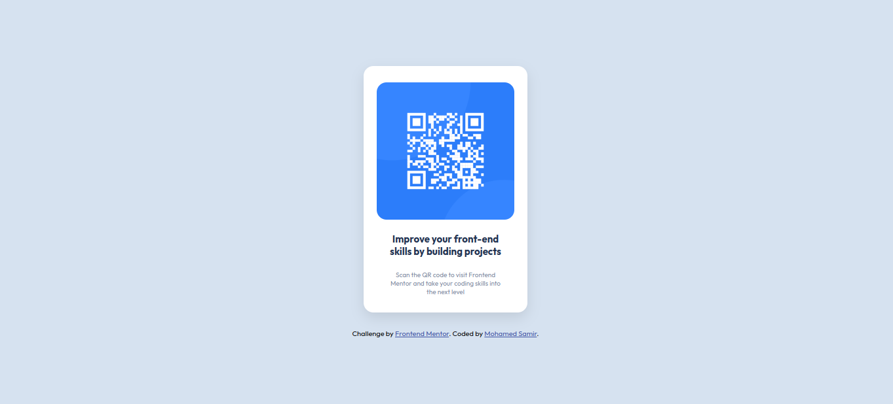
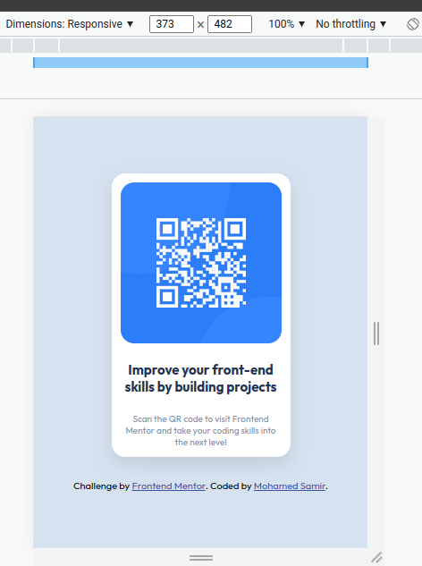

# Frontend Mentor - QR code component solution

This is a solution to the [QR code component challenge on Frontend Mentor](https://www.frontendmentor.io/challenges/qr-code-component-iux_sIO_H). Frontend Mentor challenges help you improve your coding skills by building realistic projects.

## Table of contents

- [Overview](#overview)
  - [Screenshot](#screenshot)
  - [Links](#links)
- [My process](#my-process)
  - [Built with](#built-with)
  - [What I learned](#what-i-learned)
  - [Continued development](#continued-development)
  - [Useful resources](#useful-resources)
- [Author](#author)
- [Acknowledgments](#acknowledgments)

**Note: Delete this note and update the table of contents based on what sections you keep.**

## Overview

### Screenshot

**Desktop**



**Mobile**



### Links

- Solution URL: [QR code Component solution](https://www.frontendmentor.io/solutions/qr-code-component-using-flexbox-N7enohN1iz)
- Live Site URL: [QR code Component website](https://qrcode-component-mohamed.netlify.app/)

## My process

- adding all html elements
- start styling each element until i get to the final result

### Built with

- HTML markup
- CSS properties
- Flexbox
- Desktop-first workflow

### What I learned

- i learned how to work with flex box and centring a single item in the middle of the screen
  _for example:_

```css
.parent {
  display: flex;
  justify-content: center; /*to center items horizontally*/
  align-items: center; /*to center items vertically*/
}
```

### Continued development

when i use css **REM** unit in this challenge everything scaled up i didn't know why.
i guess this is one thing i need to focus on in the future

### Useful resources

- [omnifood](https://omnifood-mohamed.netlify.app/) - This project i made by following up jonas udemy course and it helped me with the rounded corners of the image _aka: border-radius_

## Author

- LinkedIn - [Mohamed Samir](https://www.linkedin.com/in/mohamad-samir08/)
- Frontend Mentor - [@mohamed-sameer](https://www.frontendmentor.io/profile/mohamed-sameer)

## Acknowledgments

Thanks for [frontendmentor](https://www.frontendmentor.io) for providing these challenges.

Thanks for [vanzasetia](https://www.frontendmentor.io/profile/vanzasetia) for providing a feedback on my solution.
